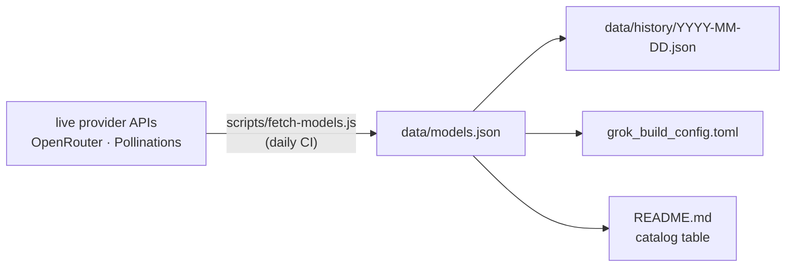

<div align="right">

[](./data/models.json)
[](https://github.com/toxicwind/free-ai-models/actions)
[](LICENSE)

</div>

# 🆓 Free AI Models Tracker

> **A community-maintained list of genuinely free AI models** — no credit card, no trial, no hidden costs. Refreshed automatically every day from the live provider APIs.

Stop paying to experiment. This repo tracks every free-tier model worth using across OpenRouter and Pollinations AI, regenerates the catalog daily, and ships a ready-to-use [grok-build](https://github.com/toxicwind/free-ai-models#--grok-build-integration) config so you can point your tooling at free models in one copy.

---

## 📡 Supported backends

| Backend | Auth | Rate limit | Models |
|---------|------|------------|--------|
| **OpenRouter** | `OPENROUTER_API_KEY` | 20 RPM (free tier) | 17 |
| **Pollinations AI** | None (keyless) | Unlimited | 4 |

**21 free models** across 2 backends. No credit card required for any of them.

## ✨ What you get

- **Daily-fresh catalog** — `scripts/fetch-models.js` hits the live APIs and regenerates everything; CI runs it every day
- **Full history** — every daily snapshot archived under `data/history/YYYY-MM-DD.json`
- **grok-build config** — auto-generated `grok_build_config.toml` with correct `base_url`, `env_key`, and `context_window` per model
- **Smart defaults** — auto-detected temperature/top_p per provider (Poolside/Cohere get 0.1/0.3)
- **Keyless tier** — Pollinations models need no API key at all

## Diagram



## ⚡ Quick start

```bash
git clone https://github.com/toxicwind/free-ai-models.git && cd free-ai-models
node scripts/fetch-models.js    # regenerate everything from live APIs
cp grok_build_config.toml ~/.config/grok-build/config.toml
```

Generated artifacts:

| File | What |
|---|---|
| `data/models.json` | Current snapshot |
| `data/history/YYYY-MM-DD.json` | Daily archive |
| `grok_build_config.toml` | grok-build config with all models |
| `README.md` | This file (table auto-updated between `TABLE_START`/`TABLE_END`) |

## 🔧 Grok-build integration

```bash
export OPENROUTER_API_KEY=your_key_here
```

The generated config includes:

- **All 21 free models** with correct `base_url`, `env_key`, `context_window`
- **OpenRouter models** → `base_url = "https://openrouter.ai/api/v1"`
- **Pollinations models** → `base_url = "https://text.pollinations.ai/openai"` (keyless)
- **Auto-detected temperature/top_p** based on provider (Poolside/Cohere get 0.1/0.3)

## 📊 Model catalog

<!-- TABLE_START -->
> Last updated: **Thu, 06 Aug 2026 23:46:23 UTC** · 21 models tracked

| # | Model | Provider | Context | Modalities | Rate Limit | Source |
|---|-------|----------|---------|------------|------------|--------|
| 1 | **Google: Lyria 3 Pro Preview** | Google | 1M | 💬 text, 🖼️ vision, audio | varies | [link](https://openrouter.ai/google/lyria-3-pro-preview) |
| 2 | **Google: Lyria 3 Clip Preview** | Google | 1M | 💬 text, 🖼️ vision, audio | varies | [link](https://openrouter.ai/google/lyria-3-clip-preview) |
| 3 | **Gemini 2.0 Flash** | Pollinations AI | 1M | 💬 text, 🖼️ vision | unlimited (no auth) | [link](https://pollinations.ai) |
| 4 | **NVIDIA: Nemotron 3 Ultra (free)** | Nvidia | 1M | 💬 text | 40 req/min | [link](https://openrouter.ai/nvidia/nemotron-3-ultra-550b-a55b:free) |
| 5 | **inclusionAI: Ling 3.0 Tiny (free)** | Inclusionai | 262K | 💬 text | varies | [link](https://openrouter.ai/inclusionai/ling-3.0-tiny:free) |
| 6 | **Poolside: Laguna S 2.1 (free)** | Poolside | 262K | 💬 text | varies | [link](https://openrouter.ai/poolside/laguna-s-2.1:free) |
| 7 | **Poolside: Laguna XS 2.1 (free)** | Poolside | 262K | 💬 text | varies | [link](https://openrouter.ai/poolside/laguna-xs-2.1:free) |
| 8 | **Google: Gemma 4 26B A4B  (free)** | Google | 262K | 🖼️ vision, 💬 text, video | varies | [link](https://openrouter.ai/google/gemma-4-26b-a4b-it:free) |
| 9 | **Google: Gemma 4 31B (free)** | Google | 262K | 🖼️ vision, 💬 text, video | varies | [link](https://openrouter.ai/google/gemma-4-31b-it:free) |
| 10 | **NVIDIA: Nemotron 3 Super (free)** | Nvidia | 262K | 💬 text | 40 req/min | [link](https://openrouter.ai/nvidia/nemotron-3-super-120b-a12b:free) |
| 11 | **Cohere: North Mini Code (free)** | Cohere | 256K | 💬 text | varies | [link](https://openrouter.ai/cohere/north-mini-code:free) |
| 12 | **NVIDIA: Nemotron 3 Nano Omni (free)** | Nvidia | 256K | 💬 text, audio, 🖼️ vision, video | 40 req/min | [link](https://openrouter.ai/nvidia/nemotron-3-nano-omni-30b-a3b-reasoning:free) |
| 13 | **NVIDIA: Nemotron 3 Nano 30B A3B (free)** | Nvidia | 256K | 💬 text | 40 req/min | [link](https://openrouter.ai/nvidia/nemotron-3-nano-30b-a3b:free) |
| 14 | **Free Models Router** | Openrouter | 200K | 💬 text, 🖼️ vision | varies | [link](https://openrouter.ai/openrouter/free) |
| 15 | **OpenAI: gpt-oss-20b (free)** | Openai | 131K | 💬 text | varies | [link](https://openrouter.ai/openai/gpt-oss-20b:free) |
| 16 | **NVIDIA: Nemotron 3.5 Content Safety (free)** | Nvidia | 128K | 💬 text, 🖼️ vision | 40 req/min | [link](https://openrouter.ai/nvidia/nemotron-3.5-content-safety:free) |
| 17 | **NVIDIA: Nemotron Nano 12B 2 VL (free)** | Nvidia | 128K | 🖼️ vision, 💬 text, video | 40 req/min | [link](https://openrouter.ai/nvidia/nemotron-nano-12b-v2-vl:free) |
| 18 | **NVIDIA: Nemotron Nano 9B V2 (free)** | Nvidia | 128K | 💬 text | 40 req/min | [link](https://openrouter.ai/nvidia/nemotron-nano-9b-v2:free) |
| 19 | **Mistral Nemo** | Pollinations AI | 128K | 💬 text | unlimited (no auth) | [link](https://pollinations.ai) |
| 20 | **Mistral Small 3.2** | Pollinations AI | 128K | 💬 text | unlimited (no auth) | [link](https://pollinations.ai) |
| 21 | **GPT-4o** | Pollinations AI | 128K | 💬 text, 🖼️ vision | unlimited (no auth) | [link](https://pollinations.ai) |
<!-- TABLE_END -->

> ⚠️ This table is **auto-generated** by `scripts/fetch-models.js` — don't edit it by hand. Add providers via `EXTRA_PROVIDERS` in the fetcher and re-run.

## 🏗 Architecture

```
free-ai-models/
├── scripts/fetch-models.js   # the fetcher: live APIs -> everything
├── data/
│   ├── models.json           # current snapshot
│   └── history/              # YYYY-MM-DD.json daily archives
├── grok_generator/           # grok-build config generation
├── grok_build_config.toml    # generated — copy to ~/.config/grok-build/
├── .github/workflows/update.yml  # daily refresh CI
└── eslint.config.js          # lint config
```

## 🤝 Contributing

1. Fork this repo
2. Add new free providers to `EXTRA_PROVIDERS` in `scripts/fetch-models.js`
3. Run `node scripts/fetch-models.js` to verify
4. Submit a PR

## 📜 License + Security

**MIT** — see [LICENSE](LICENSE). This is a **fork** of [ClawLabsAI/free-ai-models](https://github.com/ClawLabsAI/free-ai-models) by **ClawLabs**; fork author **Pup Trix / toxicwind**. Added: grok-build config generation, multi-backend support.

**Security:** the fetcher needs `OPENROUTER_API_KEY` for the OpenRouter backend — export it in your shell, never commit it. Pollinations needs no key.

> "Free AI for everyone. No gatekeepers."

## 🔗 Related

| Repo | Purpose |
|------|---------|
| [my-ai-tools](https://github.com/toxicwind/my-ai-tools) | AI tooling configs |
| [openrouter-free-model](https://github.com/toxicwind/openrouter-free-model) | OpenRouter browser |
| [sniper-super-v3](https://github.com/toxicwind/sniper-super-v3) | Contract hunter |
| [kimi-team-recon](https://github.com/toxicwind/kimi-team-recon) | Infrastructure intel |
